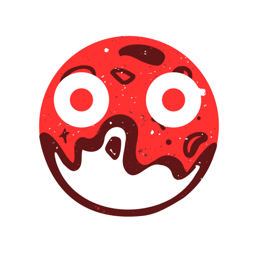

no website (for now)

### The Engine

GioDot is a fully featured, open source, MIT licensed, game engine. It focuses on having great tools, and a visual oriented workflow that can export to PC, Mobile and Web platforms with no hassle.
The editor, language and APIs are feature rich, yet simple to learn, allowing you to become productive in a matter of hours.

### About

GioDot is a fork of Godot 2.0, developed by Juan Linietsky and Ariel Manzur was born as an in-house engine, used to publish several work-for-hire titles. Godot is a member project of the [Software Freedom Conservancy](https://sfconservancy.org)

### Documentation

Documentation is hosted on [ReadTheDocs](https://docs.godotengine.org/en/2.1/).

### Binary Downloads, Community, etc.

Binary downloads, community, etc. can be found in this repository.

### Compiling from Source

See docs for compilation instructions for every platform:
[http://docs.godotengine.org/en/latest/reference/_compiling.html](https://docs.godotengine.org/en/2.1/)

